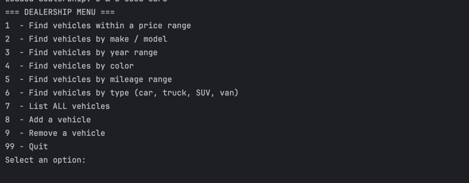
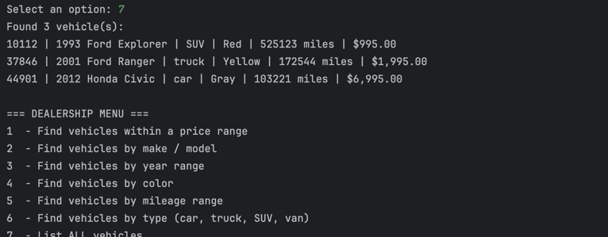
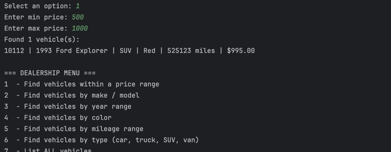

# Car Dealership Console Application

## Description of the Project

This Java console application simulates a mini car dealership system designed for use by a salesperson or sales manager. The purpose of the application is to manage and search a dealership’s vehicle inventory efficiently using an intuitive, text-based interface.

Users can view all available vehicles, search by different criteria (price, make/model, year, color, mileage, or type), and add or remove vehicles from the inventory. All inventory data is stored and updated in a pipe-delimited file, ensuring that any changes are saved automatically.

The goal is to provide a lightweight, object-oriented solution for managing vehicle data without needing a graphical interface or complex database.

## User Stories

- As a sales associate, I want to search for vehicles by price, type, or mileage so that I can quickly find options for customers.
- As a sales manager, I want to add and remove vehicles from the inventory so that I can keep the dealership’s data up to date.
- As a user, I want to view all vehicles currently in stock so that I can get a clear overview of available inventory.
- As a user, I want the application to save my updates automatically so that I don’t lose any changes.
- As a user, I want to receive clear feedback on each command so that I always know what actions were successful.

## Setup

Instructions on how to set up and run the project using IntelliJ IDEA.

### Prerequisites

- IntelliJ IDEA: Ensure you have IntelliJ IDEA installed, which you can download from [here](https://www.jetbrains.com/idea/download/).
- Java SDK: Make sure Java SDK is installed and configured in IntelliJ.

### Running the Application in IntelliJ

Follow these steps to get your application running within IntelliJ IDEA:

1. Open IntelliJ IDEA.
2. Select "Open" and navigate to the directory where you cloned or downloaded the project.
3. After the project opens, wait for IntelliJ to index the files and set up the project.
4. Find the main class with the `public static void main(String[] args)` method.
5. Right-click on the file and select 'Run 'YourMainClassName.main()'' to start the application.

## Technologies Used

- Java (Version 17)
- IntelliJ IDEA (for development and testing)
- Java I/O (java.io, java.nio) — Used for file reading and writing. 
- Collections Framework (ArrayList, Streams) — Used for managing and searching the vehicle list.

## Demo

## Future Work

- Integrate user authentication for different dealership roles.
- Implement data validation and error handling for malformed files.
- Support multiple dealership files with a “Switch Dealership” feature.

## Resources

- [Java Programming Tutorial](https://www.example.com)
- [Effective Java](https://www.example.com)

## Team Members

- Wasid Chowdhury

## Thanks

- Thank you to Raymond, Potato Sensei for continuous support and guidance.
